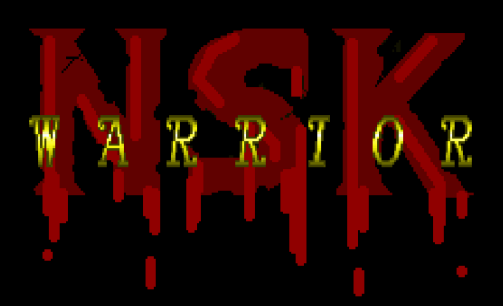

Using [**EmulatorJS**](https://github.com/EmulatorJS/) to preserve an original game created with RPG Maker (PSX).

> [!NOTE]  
> **No ROMs or bios files are included in this repo.**

## Table of Contents
- [Introduction](#introduction)
- [Usage](#usage)
- [Features](#features)
- [Booklet](#booklet)
- [License](#license)
- [Contact](#contact)
- [Acknowledgements](#acknowledgements)


---

## Introduction
**NSK Warrior** is a comical, survival-horror game about an aspiring janitor working at a grimy factory.  

Since it was originally developed using RPG Maker for the PlayStation (PSX), the game was incredibly difficult to share. 

Thanks to [**EmulatorJS**](https://github.com/EmulatorJS/), this project brings the experience to the web, making it easily accessible.

## Usage
To play the game, simply open your web browser and navigate to [nsk-warrior.netlify.app](https://nsk-warrior.netlify.app). Install the PWA to your home screen for a more integrated experience.

The game is also available at [itch.io](https://imaginary-monkey.itch.io/nsk-warrior).

## Features
- **Playable in Browser:**  Enjoy the game directly in your web browser.
  
- **PWA Support:**  Install as a Progressive Web App for a native app-like experience.
  
- **Original Game Booklet:**  While playing, flip through maps and game details in the original booklet that accompanied the game.


- **Autosave & Resume:**  Your progress is automatically saved when navigating back or when the app window is hidden. Play resumes automatically on reload.

## Booklet
To add a game booklet to your project:
- Copy the booklet folder to your project.
- Replace pages with your images.
- Add a links for the stylesheet and js files in your html.
  ```html
  <head>
  ...
    <link rel="stylesheet" href="booklet/booklet.css">
  ...
  </head>
  ...
  <body>
  ...
    <script src="https://ajax.googleapis.com/ajax/libs/jquery/3.7.1/jquery.min.js"></script>
    <script src="/booklet/turn.min.js"></script>
    <script src="/booklet/panzoom.min.js"></script>
    <script src="/booklet/booklet.js"></script>
  </body>
  ```
- Insert something like this in your html:
  ```html
  <div class="container" id="container"> <!-- Add container styles to your css -->
    <input type="checkbox" id="toggleButton" class="toggle-button">
    <label for="toggleButton">
      
    </label>
    <div id="book">
      <!-- Pages added here from script -->
    </div>
    <div id="game"></div> <!-- Or whatever the div that displays your game is called -->
  </div>
  <audio id="flip" src="sound/page_turn.mp3"></audio>
  <audio id="slide1" src="sound/slide_in.mp3"></audio>
  <audio id="slide2" src="sound/slide_out.mp3"></audio>
  <div id="blurBackground" class="blurred-background" style="display: none;"></div>
  ```

## License 

EmulatorJS is licensed under the
GNU General Public License v3.0 license.

Turn.js is released under a non-commercial BSD license.

## Contact
James Coburn - jamesrobertcoburn@gmail.com

## Acknowledgements
- [**EmulatorJS**](https://github.com/EmulatorJS/)
- **RPG Maker**
- [**Turn.js**](https://github.com/bahadirdogru/Turn.js-5)
- [**Panzoom**](https://github.com/timmywil/panzoom)

---

